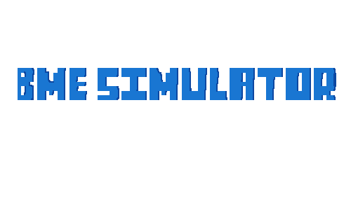
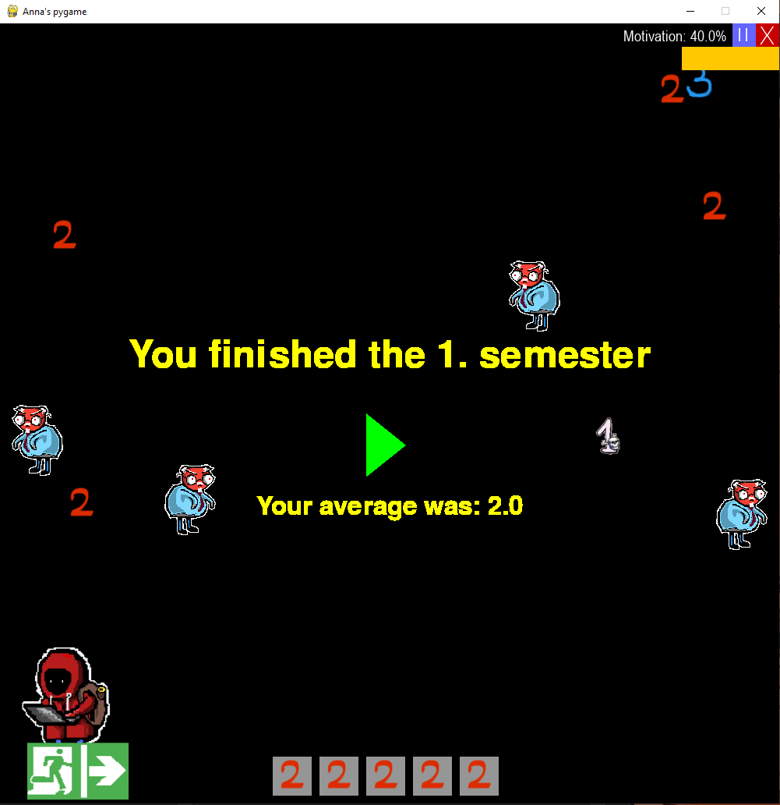
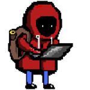
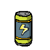
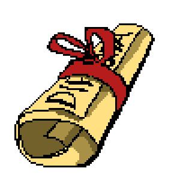
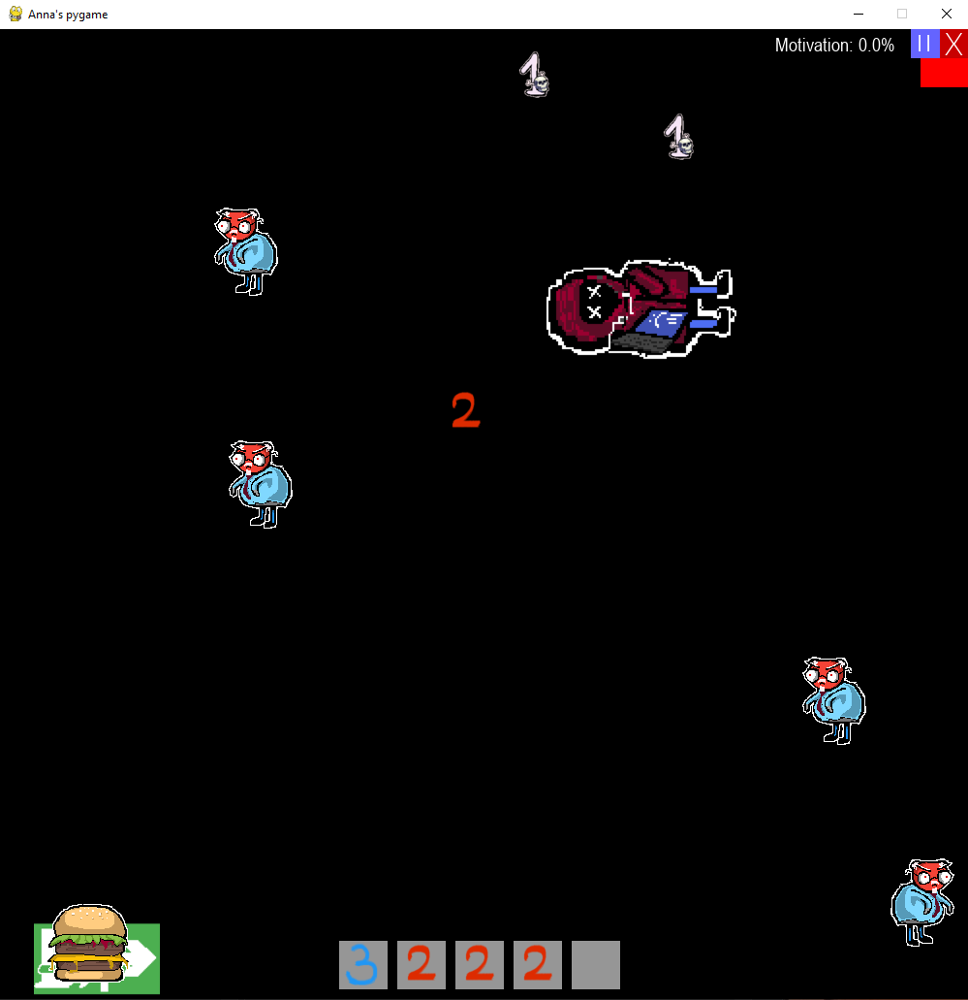
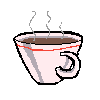

  

  <strong>A little game where you are an undergraduate at the great engineering school of Budapest</strong>

  

<table align="center">
  <tr>
    <td align="center">
       
      <b>This is you</b>
    </td>
    <td align="center">
       
      <b>Dodge the danger!</b>
    </td>
    <td align="center">
       
      <b>Fuel up with energy drinks!</b>
    </td>
    <td align="center">
       
      <b>Fight for your diploma!</b>
    </td>
    <td align="center">
       
      <b>Collect the best marks!</b>
    </td>
    <td align="center">
       
      <b>Graduate with honors!</b>
    </td>
  </tr>
</table>

  

<b>☠️ Make sure you don't lose your motivation! ☠️</b>

  

  

<h3 align="center" style="color: red;">⚠️ WARNING ⚠️</h3>

<strong>Professors like to drink coffee too... </strong>

  

Control:
- press G to pick up the marks and boosters
- once you collect 3 marks, you can go to the next semester
- stand near the exit and click on the exit sign
